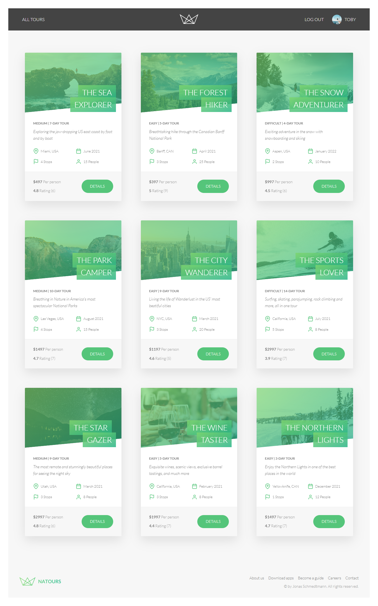
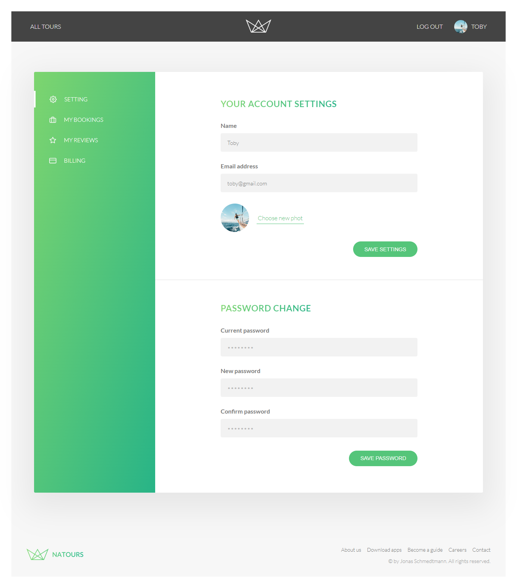

## ✨Project preview

<h1 align=center>🏕️ Natours</h1>

<h3 align="center">This was constructed using modern technologies:</h3>

    
    
    
    
    
    
    
    
    

 

 

 

#### 📚 Course project

- Node.js, Express, MongoDB & More: The Complete Bootcamp 2023, by Jonas Schmedtmann.

 

🌐The online site: <a href="https://natoursapp-0oml.onrender.com" target="_blank">🏕️ Natours</a>

 
